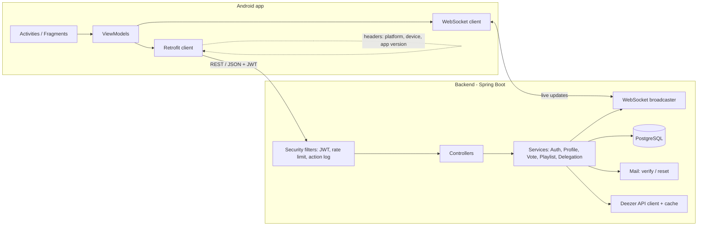

# Music Room

> Music, collaboration and mobility: a complete mobile solution focused on music and user experience.

**Status:** planning. This README is the project plan; code will land phase by phase (see [Roadmap](#roadmap)).

---

## 1. What we have to build

A **mobile app (Android)** backed by a **server that holds the truth**, connected through a **documented API**, with three collaborative services:

| Service | Idea | Key difficulty |
|---|---|---|
| **Music Track Vote** | People at a party/event suggest tracks and vote; most-voted tracks play first. | Concurrent votes on the same/different tracks. |
| **Music Playlist Editor** | Friends edit a playlist together in real time ("radio stations"). | Concurrent moves/inserts/removes of tracks. |
| **Music Control Delegation** | A user lets friends control playback on one of their devices. | Per-device permissions, routing commands to the right device. |

The subject requires **at least 2 of the 3**, but the load-test section talks about "your 3 services". **We plan all 3**, with Track Vote and Playlist Editor first.

Common requirements: accounts (email/password + Google/Facebook), profiles with visibility levels, a REST+JSON API documented with Swagger, security against malicious behaviour, a log entry for every mobile action, measured load capacity, tests per layer, and CI.

---

## 2. Tech stack and why

The subject leaves the language open, so we use **Java end to end**.

| Layer | Choice | Why |
|---|---|---|
| Backend language | **Java 21** | One language across the team; strong typing; virtual threads for high concurrency. |
| Backend framework | **Spring Boot 3** (Web, Security, Data JPA, Validation, WebSocket, Mail) | Mature, well documented, includes everything we need (auth, transactions, WebSocket). |
| Database | **PostgreSQL 16** | Relational data (users, friends, events, playlists, votes) that needs transactions, unique constraints and row locks to handle concurrency correctly. |
| DB migrations | **Flyway** | Versioned, reproducible schema. |
| API style | **REST + JSON** | Recommended by the subject; easy to consume and test; JSON is human-readable and supported natively on Android. |
| Real-time | **WebSocket** (raw Spring `WebSocketHandler` + our own small JSON protocol) | Push vote, playlist and playback updates instantly. REST stays the only write path and WebSocket only broadcasts, which keeps the server authoritative. |
| API docs | **springdoc-openapi → Swagger UI** | Generated from code, so the docs can't drift from the API. Lists methods, inputs and outputs, as required. |
| Auth | **JWT access token (short) + rotating refresh token** | Stateless API; refresh-token rotation detects session theft. |
| Rate limiting | **Bucket4j** | Brute-force protection on auth and vote endpoints. |
| Music catalog | **Deezer public API** (search + 30 s previews) | Free, no API key, legal previews. It only provides track data; all voting, editing and delegation logic is ours ("the SDK must not do your work"). |
| Mobile | **Android native, Java**, MVVM (ViewModel + LiveData), Material 3 | The subject allows Android with any technology; Java matches the backend. |
| Mobile networking | **Retrofit + OkHttp + Gson**, OkHttp WebSocket | Standard, well documented, easy to intercept (logging headers). |
| Mobile playback | **AndroidX Media3 (ExoPlayer)** | Streams the preview URLs. |
| Social login | **Google Credential Manager** + **Facebook Login SDK** | Official SDKs; the backend verifies the tokens server-side. |
| Build | **Gradle wrapper** + root **Makefile** | Dependencies download automatically from a fresh clone (subject IV.1). |
| Local infra | **Docker Compose**: Postgres + Mailpit (fake SMTP) | One command to get a working dev environment. |
| Tests | JUnit 5, Mockito, Spring Boot Test, **Testcontainers**; Android JUnit + Espresso | Each layer is tested against a real Postgres, not mocks. |
| Load testing | **Gatling (Java DSL)** | Load scenarios in the same language as the code. |
| CI | **GitHub Actions** | Build + test backend and Android on every push/PR. |

---

## 3. Architecture



Principles:

- **Server is the source of truth.** The app is a "remote control": it displays state and sends intents. No business rule lives only on the client.
- **Writes go through REST, updates come back over WebSocket.** Every change is broadcast to the subscribed channel (`event:{id}`, `playlist:{id}`, `device:{id}`) with a version number, so clients know when they missed something and refetch.
- **Back-end address is configurable** in the app's Settings screen (stored in SharedPreferences, default from `BuildConfig`).

---

## 4. Service design

### 4.1 Users & profiles

- Sign-up with **email/password** (BCrypt), **mandatory email verification**, **forgot password** via a single-use, expiring token sent by email.
- Sign-up / login with **Google or Facebook**: the app gets a token from the SDK, the backend verifies it with Google or Facebook (including audience check), then issues our own JWT.
- **Link** a Google/Facebook account to an existing account (and unlink).
- Profile split into **public**, **friends-only** and **private** info, plus **music preferences** (genres/artists). The API filters fields based on who is asking (self / friend / anyone).
- **Friends**: request, accept, refuse, remove.
- **Devices**: every logged-in device is registered (name, platform, model, app version) for Control Delegation and logging.

### 4.2 Music Track Vote

- An event has a **visibility** setting: `PUBLIC` (default, anyone can find and vote) or `PRIVATE` (only invited users can find it and vote).
- An event has a **vote license**: `EVERYONE` (default), `INVITED_ONLY`, or `LOCATION_AND_TIME` (vote only within X metres of a point and between two times, e.g. 16:00–18:00). The server checks distance and time and never trusts the client's decision.
- Anyone allowed can **suggest** a track (Deezer search) and **vote**. The queue is ordered by `vote_count DESC, suggested_at ASC`.
- The host's device plays the top track. When it ends, the host reports it and the server picks the next track.

**Concurrency:**
- A vote is a row in `votes(event_track_id, user_id)` with a **primary key on the pair**, so double votes are impossible even under a race.
- Inserting the vote and running `UPDATE event_tracks SET vote_count = vote_count + 1` happen in **one transaction**. The increment is atomic in SQL, so there are no lost updates when many people vote for the same track at once.
- Suggesting a track already in the queue becomes a vote for it (unique `(event_id, deezer_track_id)` while queued).
- After each change, the new ordered queue (with a version number) is broadcast to `event:{id}`.

### 4.3 Music Playlist Editor

- **Visibility**: `PUBLIC` (default, everyone can access it) or `PRIVATE` (invited users only).
- **Edit license**: `EVERYONE` (default) or `INVITED_ONLY`.
- Operations: add track, remove track, move track, rename.

**Concurrency:**
- Each playlist has a `version` counter. All edits to the same playlist are **serialized** with `SELECT … FOR UPDATE` on the playlist row, so two edits never interleave.
- Operations refer to **track IDs, not indexes**: "move track A after track B". Concurrent moves of *different* tracks both apply cleanly. Concurrent moves of the *same* track are resolved by server order (last write wins), and every client converges because the server broadcasts each operation with its new version.
- If an anchor track no longer exists (deleted meanwhile), the server returns **409 Conflict** with the current state; the client refreshes and shows a small notice.
- Positions use spaced integers (or fractional ranks) so a move updates one row instead of the whole list.

### 4.4 Music Control Delegation

- A user grants a friend control of **one specific device** (each device has its own license): permissions such as `PLAY_PAUSE`, `SKIP`, `VOLUME`, optionally with an expiry.
- The delegate sends a command over REST. The server checks the delegation for *that* device and pushes the command to `device:{id}` over WebSocket. The device executes it and reports its new playback state, which is broadcast back.
- The owner can revoke a delegation at any time, effective immediately.

---

## 5. Data model (first draft)

```
users(id, email, password_hash, email_verified, created_at)
social_accounts(user_id, provider, provider_user_id)                 unique(provider, provider_user_id)
profiles(user_id, public_info, friends_info, private_info, music_preferences)
friendships(requester_id, addressee_id, status)
devices(id, user_id, name, platform, model, app_version, last_seen_at)
refresh_tokens(id, user_id, device_id, token_hash, family_id, expires_at, revoked_at)
email_tokens(id, user_id, type[VERIFY|RESET], token_hash, expires_at, used_at)

events(id, owner_id, name, visibility, vote_license, lat, lng, radius_m, vote_start, vote_end, version)
event_invites(event_id, user_id)
event_tracks(id, event_id, deezer_track_id, title, artist, cover_url, preview_url,
             suggested_by, vote_count, status[QUEUED|PLAYING|PLAYED], suggested_at)
votes(event_track_id, user_id)                                       PK(event_track_id, user_id)

playlists(id, owner_id, name, visibility, edit_license, version)
playlist_invites(playlist_id, user_id)
playlist_tracks(id, playlist_id, deezer_track_id, title, artist, position, added_by)

delegations(id, owner_id, device_id, delegate_id, permissions, expires_at, revoked_at)

action_logs(id, user_id, method, path, status, platform, device, app_version, ip, created_at)
```

---

## 6. API overview

Full reference: **Swagger UI** at `http://<host>:8080/swagger-ui.html` (generated).

| Area | Endpoints (prefix `/api/v1`) |
|---|---|
| Auth | `POST /auth/register`, `POST /auth/login`, `POST /auth/verify-email`, `POST /auth/forgot-password`, `POST /auth/reset-password`, `POST /auth/oauth/{google\|facebook}`, `POST /auth/refresh`, `POST /auth/logout` |
| Account links | `POST /me/links/{provider}`, `DELETE /me/links/{provider}` |
| Profile | `GET/PATCH /me`, `GET /users/{id}` (fields filtered by relationship) |
| Friends | `GET /friends`, `POST /friends/requests`, `POST /friends/requests/{id}/accept`, `DELETE /friends/{id}` |
| Devices | `GET /me/devices`, `DELETE /me/devices/{id}` |
| Tracks | `GET /tracks/search?q=` (Deezer proxy + cache) |
| Events (Vote) | `GET/POST /events`, `GET/PATCH /events/{id}`, `POST /events/{id}/invites`, `POST /events/{id}/tracks`, `POST /events/{id}/tracks/{tid}/vote`, `DELETE …/vote`, `POST /events/{id}/next` |
| Playlists | `GET/POST /playlists`, `GET/PATCH /playlists/{id}`, `POST /playlists/{id}/invites`, `POST /playlists/{id}/tracks`, `PATCH /playlists/{id}/tracks/{tid}/move`, `DELETE /playlists/{id}/tracks/{tid}` |
| Delegation | `GET/POST /delegations`, `DELETE /delegations/{id}`, `POST /devices/{id}/commands` |
| Real-time | `GET /ws` (WebSocket, JWT on connect): `subscribe` / `unsubscribe` to `event:*`, `playlist:*`, `device:*` |

Errors use one JSON shape: `{ "error": "CODE", "message": "...", "details": {...} }`, with proper HTTP status codes (400/401/403/404/409/429).

---

## 7. Security plan

| Threat | Protection |
|---|---|
| Accessing another user's data (IDOR) | Every service method checks ownership/invite/friendship from the **JWT identity**, never from IDs sent by the client. Integration tests cover it. |
| Brute force on login / reset / vote | Bucket4j rate limits per IP and per account, with progressive back-off; generic error messages. |
| Session theft | Access token lives 15 min; refresh tokens are **rotated** on each use and stored hashed; reusing an old refresh token revokes the whole token family (all sessions of that device). Logout revokes. |
| Weak / leaked passwords | BCrypt (cost 12), minimum length policy, verification and reset tokens are single-use, hashed and expiring. |
| Account enumeration | Register / forgot-password always return the same response. |
| Forged social login | Google ID token / Facebook token verified server-side, audience = our app ID. |
| Injection, mass assignment | JPA parameterized queries, Bean Validation on all DTOs, separate request/response DTOs (never bind entities). |
| Location spoofing (vote license) | Server-side distance + time check. Known limit: GPS can be faked on rooted devices. Documented, with possible mitigations (Play Integrity, mock-location flag). |
| Traffic sniffing | HTTPS in deployment (TLS at a reverse proxy); Android `network_security_config` allows cleartext only for local dev. |
| Leaked secrets | All secrets in `.env` (git-ignored); `.env.example` committed with placeholder values only. |
| DoS / abuse | Rate limits, request size limits, pagination on every list endpoint. |

---

## 8. Logging (every mobile action)

- The Android OkHttp interceptor adds to **every** request: `X-Platform` (e.g. `Android 14`), `X-Device` (e.g. `Samsung SM-G998B`), `X-App-Version` (e.g. `1.0.0`).
- A backend filter writes one row per request to `action_logs` (user, method, path, status, platform, device, app version, IP, time) plus structured JSON logs to stdout.

---

## 9. Ramp-up (load testing) plan

- **Tool:** Gatling (Java DSL), in `load-tests/`.
- **Scenarios:** (1) vote storm: N users voting on the same event; (2) concurrent playlist editing: N users moving and adding tracks on one playlist; (3) delegation command bursts; (4) mixed realistic traffic across all three services.
- **Method:** ramp users up until p95 latency > 500 ms or error rate > 1 %. That point is our capacity.
- **Report** (`docs/ramp-up.md`): server specs (CPU, RAM, cloud or on-premise, OS, JVM settings), DB specs, results per scenario, the bottleneck found, and what we changed.
- **Target:** thousands of concurrent users on a low-end server, as the subject expects.

---

## 10. Repository layout (planned)

```
music-room/
├── backend/            Spring Boot API (Gradle)
│   └── src/main/java/…  auth, profile, friend, device, event, playlist, delegation, log, common
├── mobile/             Android app, Java (Gradle)
├── load-tests/         Gatling simulations
├── docs/               architecture decisions, security notes, ramp-up report
├── docker-compose.yml  Postgres + Mailpit
├── Makefile            setup / run / test / load-test entry points
├── .env.example        every variable needed, no real values
└── README.md
```

---

## 11. Getting started (once code lands)

Requirements: JDK 21, Docker, Android Studio (or Android SDK + `ANDROID_HOME`), `make`.

```bash
git clone git@github.com:eyubech/music-room.git
cd music-room
cp .env.example .env          # fill in your own secrets
make up                       # start Postgres + Mailpit
make backend                  # run the API on :8080  →  /swagger-ui.html
make mobile                   # build the debug APK
make test                     # all backend + mobile unit tests
make load-test                # Gatling scenarios
```

Planned `.env` variables: `DB_URL`, `DB_USER`, `DB_PASSWORD`, `JWT_SECRET`, `MAIL_HOST`, `MAIL_PORT`, `GOOGLE_CLIENT_ID`, `FACEBOOK_APP_ID`, `FACEBOOK_APP_SECRET`, `APP_BASE_URL`.

---

## Roadmap

Each phase ends with working, tested, merged code. The mandatory part must be **perfect** before any bonus is graded.

### Phase 0: Foundation
- [ ] Monorepo skeleton: `backend/`, `mobile/`, `load-tests/`, `docs/`
- [ ] Makefile, `docker-compose.yml`, `.env.example`
- [ ] GitHub Actions CI (backend build + tests with Testcontainers, Android assemble + unit tests)
- [ ] Spring Boot app with Flyway, Swagger UI, health endpoint, global error handler
- [ ] Android app shell: navigation, Settings screen with configurable backend URL, Retrofit client, logging-headers interceptor
- [ ] Action-log filter on the backend

### Phase 1: Users
- [ ] Register / login (email + password), JWT + refresh rotation
- [ ] Email verification + forgot / reset password (Mailpit in dev)
- [ ] Google and Facebook sign-in (app SDKs + server-side verification)
- [ ] Link / unlink social accounts
- [ ] Profile with public / friends / private sections + music preferences
- [ ] Friends (request, accept, remove) and device registry
- [ ] Rate limiting on auth endpoints

### Phase 2: Music Track Vote
- [ ] Deezer search proxy with caching
- [ ] Events CRUD, visibility, invites
- [ ] Vote licenses: everyone / invited / location + time window
- [ ] Suggest + vote with concurrency-safe counting
- [ ] WebSocket live queue + host playback with Media3
- [ ] Concurrency tests (parallel votes on same and different tracks)

### Phase 3: Music Playlist Editor
- [ ] Playlists CRUD, visibility, edit license, invites
- [ ] Add / remove / move by track ID with versioning and row locking
- [ ] WebSocket live sync + 409 conflict handling on the client
- [ ] Concurrency tests (parallel moves of same and different tracks)

### Phase 4: Music Control Delegation
- [ ] Per-device delegations with permissions and expiry
- [ ] Command routing over WebSocket to the target device, state feedback
- [ ] Revoke takes effect immediately

### Phase 5: Hardening & quality
- [ ] Authorization tests for every endpoint (no cross-user access)
- [ ] Security review against the table in section 7; write `docs/security.md`
- [ ] Error states, loading states, empty states in the app

### Phase 6: Ramp-up
- [ ] Gatling scenarios for the 3 services
- [ ] Run on documented hardware, tune (indexes, connection pool, virtual threads), write `docs/ramp-up.md`

### Phase 7: Defense prep
- [ ] Every tech decision justified in `docs/decisions.md` (REST vs others, JSON vs others, Postgres, Java)
- [ ] Demo script covering every mandatory point
- [ ] Each team member can explain every layer

### Bonus (only if mandatory is perfect)
- [ ] Offline mode: Room cache + outbox queue, sync with conflict handling on reconnect
- [ ] Free vs paid subscription (e.g. Playlist Editor paid only)
- [ ] Responsive web client on the same API
- [ ] IoT: BLE beacon near an event shows its info

---

## Team split (adjust to team size)

| Role | Owns |
|---|---|
| Backend: core | Auth, JWT, social login, profiles, friends, devices, security, logs |
| Backend: services | Events/votes, playlists, delegation, WebSocket, concurrency tests |
| Mobile | All Android screens, SDK integration, playback, real-time client |
| Quality / DevOps | CI, Docker, Makefile, Gatling, docs, cross-layer tests |

Everyone reviews everyone's PRs, so knowledge spreads across layers before the defense.

---

## Conventions

- **Branches:** `feature/<scope>`, `fix/<scope>`; merge to `main` via PR with at least one review and green CI.
- **Commits:** `feat(vote): …`, `fix(auth): …`, `test(playlist): …`, `docs: …`
- **Secrets:** never committed. Only `.env.example` lives in git.
- **Dependencies:** never commit third-party libraries; Gradle downloads them.
- **AI usage:** per subject Chapter II, note in the PR description which parts were AI-assisted, and make sure the author can explain them.
